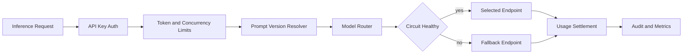

# AI Gateway Control Plane

A provider-neutral model gateway control plane with capability routing, token and concurrency limits, budget settlement, circuit breaking, prompt versioning, and auditable decisions.

This repository implements an original, laptop-scale reference system for a
production problem that repeatedly appears in strong AI/ML/software-engineering
portfolios. It focuses on architecture, failure handling, evaluation, and
reproducibility instead of claiming access to proprietary infrastructure.

## What is implemented

- Capability-, latency-, and cost-aware model routing
- Per-API-key token buckets plus in-flight concurrency limits
- Pre-authorization and post-response token-cost settlement
- Circuit breaker with recovery window and fallback routing
- Immutable prompt versions and structured audit records

## Architecture



## Quick start

```bash
python -m venv .venv
source .venv/bin/activate
python -m pip install -e .
python -m unittest discover -s tests -v
PYTHONPATH=src python src/ai_gateway_control_plane/core.py
```

The demo prints a self-contained JSON report from seeded synthetic fixtures;
wall-clock latency values are machine-dependent. It is safe to run offline and
does not require credentials, paid APIs, GPUs, or employer data.

## Evaluation contract

The simulator drives successful, rate-limited, over-budget, and endpoint-failure paths. Tests verify deterministic fallback, budget conservation, prompt rollback, and breaker recovery without calling external models.

## Repository layout

- `src/ai_gateway_control_plane/core.py` - executable reference implementation
- `tests/test_core.py` - deterministic regression and failure-path tests
- `benchmark-report.json` - checked-in output from the deterministic demo
- `.github/workflows/ci.yml` - clean-install CI on Python 3.12

## Scope and provenance

The problem definition was inspired by recurring engineering patterns observed
while reviewing a large resume corpus. All naming, source code, fixtures, and
documentation in this repository are original. Reported demo numbers are local
synthetic measurements, not production claims. The system is intentionally
compact so reviewers can inspect every design decision.

## License

MIT
