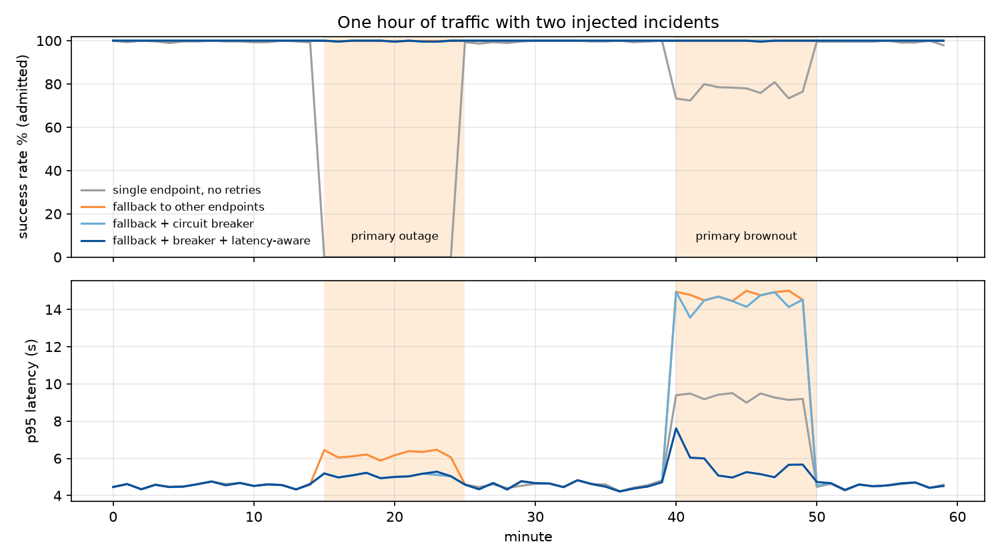
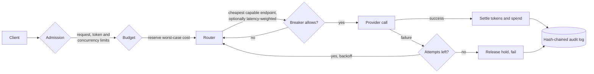

# AI Gateway Control Plane

[](https://github.com/asher0913/ai-gateway-control-plane/actions/workflows/ci.yml)

[](LICENSE)

The control plane that sits between applications and hosted LLM providers: per-tenant rate and
spend enforcement, circuit breakers, fallback routing, canary prompt releases and a tamper-evident
audit log. Each resilience feature can be switched on separately, so its effect can be measured
with a **deterministic fault-injection simulation** that replays the same hour of traffic through
two provider incidents.



## Quick start

```bash
git clone https://github.com/asher0913/ai-gateway-control-plane && cd ai-gateway-control-plane
python3 -m venv .venv && . .venv/bin/activate && pip install -e '.[dev]'
aigw simulate --out runs/simulation.json
```

This needs Python 3.10+ and nothing else. The simulation replays the hour below through all five
policies in about a second. CI runs the same command on every push and requires the output to
equal `results/simulation.json` exactly. `aigw serve` (under "Run the service") starts the same
gateway as an HTTP service.

## Results

One simulated hour: 20,622 requests from three tenants; the cheap primary provider has a
10-minute **hard outage** (minute 15) and a 10-minute **brownout** (minute 40: 3× latency, 5%
errors). Latency is end to end for successful requests, including failed attempts and backoff.

| Policy | Success | During outage | During brownout | p95 | p99 | Failed calls to primary | Cost |
|---|---:|---:|---:|---:|---:|---:|---:|
| Single endpoint, no retries | 78.58% | 0.0% | 76.7% | 7.03 s | 9.19 s | 3,460 | $5.75 |
| Same-endpoint retries (×3) | 81.66% | 0.4% | 93.6% | 8.35 s | 20.00 s | 9,454 | $5.95 |
| Fallback to other endpoints | 100.00% | 100.0% | 100.0% | 8.29 s | 14.60 s | 2,833 | $28.06 |
| Fallback + circuit breaker | 99.97% | 99.8% | 100.0% | 7.66 s | 14.30 s | 533 | $30.91 |
| **Fallback + breaker + latency-aware routing** | **99.96%** | **99.8%** | **100.0%** | **4.81 s** | **5.82 s** | **149** | $41.36 |

What each layer buys:

- **Same-endpoint retries are mostly harmful.** They cannot help during an outage, they nearly
  triple the load on a sick provider (9,454 failed calls), and they push p99 latency to 20 s.
- **Fallback fixes availability, not latency.** Every request still tries the dead provider first
  and pays for the failure, so p95 and p99 during incidents reach 6 s and 15 s.
- **The circuit breaker stops the waste.** It opens about 4 s into the outage and cuts failed calls
  to the primary by 81%, probing every 30 s until the provider recovers.
- **Latency-aware routing handles what the breaker cannot see.** A brownout with 5% errors never
  trips a 50%-failure breaker. An EWMA of observed latency makes the router move traffic away
  while the primary is slow, cutting p99 from 14.3 s to 5.8 s.
- **Resilience has a price.** During incidents traffic lands on providers that cost 17–25× more per
  token, so cost per successful request rises from $0.45 to $2.91 per thousand. The latency weight
  in the routing score is the knob that trades one for the other.

Across every policy the invariants hold: no tenant ever spends beyond its budget; the noisy
`batch` tenant (offering twice its request quota) has 51% of its traffic rate-limited while the
other tenants lose under 0.2%; its $1 budget runs out and later requests are rejected with 402;
the canary prompt serves 9.7–9.9% of successful requests against a 10% target; and every one of the
20,622 audit records verifies.

Reproduce with `aigw simulate --out results/simulation.json` (about 1 s).

## Architecture



| Component | Behaviour |
|---|---|
| `RateLimiter` | Per tenant: requests/min and tokens/min token buckets (10 s burst), plus an in-flight cap. Admission charges the *estimated* tokens; settlement refunds or charges the difference once the real usage is known. |
| `BudgetLedger` | `reserve` the worst-case cost across every endpoint a fallback could reach, `commit` the actual cost (never more than the hold), `release` on failure. `spent + reserved ≤ limit` always, even with many requests in flight. |
| `CircuitBreaker` | Sliding window of the last 20 calls; opens at ≥50% failures once 10 calls are recorded; after 30 s lets 3 probes through; all succeed → closed, any fails → open again. Results arriving after it opened are ignored. |
| `LatencyEstimator` | EWMA per endpoint that decays toward a prior with a 60 s half-life. Without the decay, an endpoint the router stopped using would keep its bad estimate forever and never win traffic back. |
| `PromptRegistry` | Immutable versions with content digests, a stable pointer, weighted canaries keyed on a SHA-256 of the request id (sticky across retries and replicas), promote and rollback. |
| `AuditLog` | Each record stores the previous record's hash; editing, deleting or reordering any record is detected by `verify()`. |

The gateway is written as two event handlers, `on_arrival` and `on_attempt_done`, so exactly the
same code runs in the discrete-event simulator and behind the HTTP service.

## Evidence and CI coverage

| Result | Kind of evidence | File | Rerun in CI? |
|---|---|---|---|
| Policy table, incident timeline and invariants | deterministic discrete-event simulation; providers, prices and incidents are illustrative | `results/simulation.json`, `docs/incident_timeline.png` | Numbers: yes, exact match. Figure: drawn from the same file by `scripts/make_figures.py`, not in CI. |
| Breaker, budget, rate-limit and audit-chain behaviour | unit tests | `tests/` (29 tests) | Yes |
| HTTP error mapping and failover through an injected outage | FastAPI test client | `tests/` | Yes |

Nothing here is a measurement against a real LLM provider.

## Design trade-offs

| Decision | Chosen | Alternative | Why |
|---|---|---|---|
| Budget enforcement | reserve the worst-case cost of every endpoint a fallback could reach, then settle | charge after the call | Charging afterwards lets concurrent requests overshoot the budget; reservations keep `spent + reserved ≤ limit`. The cost is some requests rejected that would have fit. |
| Failure handling | fallback + circuit breaker + latency-aware routing | retries on the same endpoint | Same-endpoint retries tripled the load on a failing provider and doubled p99 (table above). |
| Brownout detection | EWMA of latency that decays toward a prior | failure-rate breaker only | A 5%-error brownout never trips a 50% breaker; the decay lets a recovered endpoint win traffic back. |
| Code structure | two event handlers shared by the simulator and the server | separate simulator | The code that is measured is the code that serves. |
| Audit | hash-chained log | append-only table | Edits, deletions and reordering are detectable by `verify()` without external infrastructure. |

## Code map

| File | What to look at |
|---|---|
| `src/aigw/gateway.py` | `Gateway.on_arrival` and `on_attempt_done` (the whole control flow), `rank` and `_choose` (routing), `LatencyEstimator` |
| `src/aigw/controls.py` | `TokenBucket`, `RateLimiter.admit`/`settle`, `BudgetLedger.reserve`/`commit`/`release`, `CircuitBreaker.allow`/`record` |
| `src/aigw/registry.py` | prompt versions, sticky weighted canaries, the hash-chained `AuditLog` |
| `src/aigw/sim.py` | the traffic model, the two incidents and the five policies |
| `src/aigw/server.py` | FastAPI service: `/v1/chat/completions` and the admin endpoints |

## Run the service

```bash
pip install -e '.[server,dev]'
aigw serve --port 8000
```

```bash
curl -s localhost:8000/v1/chat/completions -H 'x-tenant: search' -H 'content-type: application/json' \
  -d '{"messages":[{"role":"user","content":"hello"}],"max_tokens":128}'

curl -s -X POST 'localhost:8000/v1/admin/incidents/primary?seconds=120'   # inject an outage
curl -s localhost:8000/v1/admin/breakers                                  # {"primary":"open",...}
curl -s localhost:8000/v1/admin/audit/verify
```

The service exposes an OpenAI-style `/v1/chat/completions` endpoint and maps gateway outcomes to
HTTP semantics: 429 for rate limits, 402 for budget, 401 for unknown tenants, 503 when no healthy
endpoint remains and 502 when every attempt failed. Providers are simulated; replacing the `call`
function in `server.py` with a real HTTP client is the only change needed to front live APIs.

## Tests

`pytest -q` runs 29 tests in about 2 seconds: token-bucket refill and burst, refund on settlement,
the request slot returned when the token check fails, reservations that block overspend, every
breaker transition including limited half-open probes and ignored late results, canary share and
stickiness, promote and rollback, detection of edited and reordered audit records, fallback
choosing a different endpoint, open breakers skipped up front, worst-case budget holds, EWMA
decay, determinism of the simulation, the policy ranking in the table above, and the HTTP error
mapping plus failover through an injected outage.

## Limitations

- Providers and traffic are simulated. Latency distributions, prices and incident shapes are
  illustrative, chosen to exercise the control logic rather than to model a specific vendor.
- State is in-process. A multi-replica deployment needs shared rate-limit and budget state (for
  example Redis with atomic scripts) and per-replica or shared breaker state by design choice.
- Token counts in the HTTP service are estimated from characters; a tokenizer per model family
  would make admission estimates tighter.
- Streaming responses, request hedging and cancellation are not modelled.

## Known issues

The HTTP service is a demo of the control logic and is not yet safe to expose:

- **The admin endpoints are unauthenticated.** Anyone who can reach the service can inject
  incidents with `POST /v1/admin/incidents/{endpoint}` and read breaker, budget and audit state.
- **The tenant is whatever the `x-tenant` header says.** Nothing ties the header to a credential,
  so a caller can spend another tenant's budget. In production the tenant must come from an API key
  or a verified token.

## License

MIT
